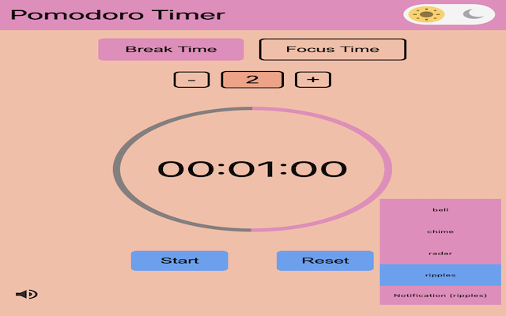
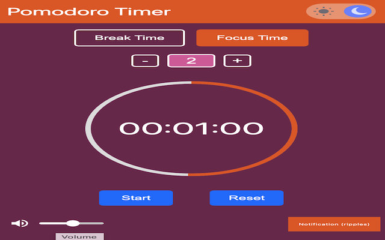

# Pomodoro Timer Chrome Extension


## Overview

The **Pomodoro Timer Chrome Extension** is a productivity tool designed to help users manage their time more effectively using the Pomodoro Technique. This Chrome extension integrates seamlessly into the user's browser, providing a simple and intuitive interface to track work sessions and breaks directly from the browser toolbar.

<div align="center">
  
  
</div>

## Features

- **Simple and Intuitive UI:** A clean and easy-to-use interface that enables users to start, pause, and reset the timer effortlessly.
- **Customizable Timer:** Allows users to set custom durations for work sessions and breaks to suit their personal productivity style.
- **Notifications:** Get notified when a work session or break is about to end, ensuring you stay on track without constantly checking the timer.
- **Progress Tracking:** Visual progress ring displays the remaining time for both work sessions and breaks, giving a clear visual indication of time left.
- **Dark Mode:** Integrated light and dark themes to reduce eye strain and match the user's preferred browser theme.
- **Persistent Timer:** The timer runs in the background even when the extension popup is closed, ensuring continuity without interruptions.

## Use Cases

### For Students:
Boost your study sessions with the Pomodoro Technique, allowing you to focus on your tasks while taking regular breaks to maintain productivity throughout the day.

### For Developers:
Manage coding sprints and debugging sessions efficiently. Stay focused during intense work periods and take meaningful breaks to avoid burnout.

### For Remote Workers:
Maximize your remote working hours by managing your time effectively. Break down your work into manageable intervals, staying productive without getting overwhelmed.

## Why This Project Stands Out

- **User-Centric Design:** Built with the end-user in mind, focusing on ease of use and accessibility.
- **Background Execution:** Unlike many other timers, this extension keeps running in the background even when the popup is closed, ensuring you don’t lose track of your progress.
- **Custom Notifications:** Never miss an important break or work session with customizable notifications, ensuring that you stay in control of your schedule.
- **Tech Stack:** Leveraging HTML, CSS, JavaScript, and Chrome extension APIs, this project demonstrates proficiency in front-end development and browser-based application design.

## Installation

1. Clone the repository:
   ```bash
   git clone https://github.com/Gowtham-369/pomodoro-timer-chrome-extension.git
   ```
2. Go to `chrome://extensions/` in your browser.
3. Enable **Developer mode**.
4. Click on **Load unpacked** and select the cloned directory.

## Contributing

Contributions are welcome! Please open an issue or submit a pull request with your ideas for enhancing the extension.

## License

This project is licensed under the MIT License - see the [LICENSE](./LICENSE) file for details.

## Contact

Feel free to reach out for any questions or feedback:
- **Email:** gowthamreddyu@gmail.com
- **LinkedIn:** [Gowtham Reddy Uppunuri](https://www.linkedin.com/in/gowthamreddyuppunuri/)
